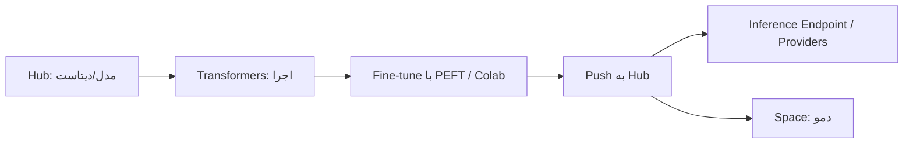

## ۱. Hugging Face دقیقاً چیست؟

Hugging Face یک پلتفرم متن‌باز برای هوش مصنوعی است. مدل‌های آماده، دیتاست‌ها و ابزارهای آموزش، ارزیابی و استقرار را یک‌جا در اختیار شما می‌گذارد. بنابراین لازم نیست همه‌چیز را از ابتدا بسازید.

اگر سابقه کار با npm یا NuGet دارید، این مقایسه کمک می‌کند:

| بخش | کارکرد | مثال تشبیهی |
|---|---|---|
| Hub (Models) | مخزن مدل‌های آماده | npm / NuGet برای مدل |
| Datasets | داده‌های آماده برای آموزش و ارزیابی | مخزن داده |
| Spaces | میزبانی دموی وب (Gradio/Streamlit) | GitHub Pages برای AI |
| Transformers | کتابخانه بارگذاری و اجرای مدل | SDK اصلی |
| Inference Providers | API یکپارچه برای اجرای مدل روی سرور | OpenAI-compatible API |
| Inference Endpoints | استقرار اختصاصی | سرور اختصاصی |

سه بخش اول، یعنی مدل‌ها، دیتاست‌ها و Spaces، هسته اصلی پلتفرم هستند. هر مدل یا دیتاست یک مخزن مبتنی بر Git است، پس branch، commit، نسخه‌گذاری و pull request در آن‌ها معنا دارد. برای یک توسعه‌دهنده این نکته مهم است، چون نسخه مدل را هم مثل وابستگی‌های کد می‌توان قفل کرد.

## ۲. شروع سریع: حساب، توکن، نصب

1. در huggingface.co ثبت‌نام کنید و ایمیل خود را تأیید کنید.
2. از بخش Settings → Access Tokens یک توکن بسازید.
3. محیط پایتون را آماده کنید:

```bash
python -m venv .venv
# ویندوز:  .venv\Scripts\activate
# لینوکس/مک: source .venv/bin/activate

pip install transformers datasets evaluate accelerate huggingface_hub torch
```

پکیج `huggingface_hub` یک CLI رسمی با نام `hf` دارد. با آن وارد حساب می‌شوید، ریپو می‌سازید و فایل آپلود یا دانلود می‌کنید.

```bash
hf auth login
```

در محیط‌های غیرتعاملی مثل CI از `--token $HF_TOKEN` استفاده کنید. توکن را هرگز داخل کد یا ریپو قرار ندهید.

یک نکته امنیتی هم وجود دارد: برای هر کاربرد یک توکن جدا با کمترین دسترسی بسازید. مثلاً برای فراخوانی Inference Providers، مستندات یک توکن fine-grained با مجوز «Make calls to Inference Providers» را توصیه می‌کنند.

## ۳. اولین مدل شما با pipeline

`pipeline` ساده‌ترین راه برای استفاده از مدل‌هاست. بیشتر پیچیدگی‌ها را پنهان می‌کند و با هر مدل Hub کار می‌کند.

```python
from transformers import pipeline

classifier = pipeline("sentiment-analysis")
result = classifier("I really love working with Hugging Face!")
print(result)
```

در پشت صحنه سه مرحله اجرا می‌شود:

1. **Tokenizer** متن را به عدد تبدیل می‌کند. پیاده‌سازی سریع آن با Rust نوشته شده است.
2. **Model** روی این اعداد محاسبه انجام می‌دهد.
3. **Post-processing** خروجی خام را به برچسب و امتیاز تبدیل می‌کند.

برای استفاده از یک مدل مشخص، نام آن را بدهید:

```python
from transformers import pipeline

summarizer = pipeline("summarization", model="facebook/bart-large-cnn")
```

نام مدل به شکل `سازمان/نام‌مدل` است. بعد از اولین اجرا، مدل در کش محلی ذخیره می‌شود و دفعه بعد دوباره دانلود نخواهد شد.

## ۴. مدل مناسب را چگونه انتخاب کنیم؟

در صفحه Models، فیلترها را به این ترتیب اعمال کنید:

- **Task:** مثلاً Text Generation، Translation یا Automatic Speech Recognition.
- **Language:** برای محتوای فارسی حتماً مدل چندزبانه یا مخصوص فارسی را انتخاب کنید.
- **License:** اگر پروژه تجاری است، لایسنس را در Model Card بخوانید.
- **Size و سخت‌افزار:** مدل ۷ میلیارد پارامتری روی لپ‌تاپ معمولی اجرا نمی‌شود، مگر اینکه کوانتیزه شده باشد.
- **Model Card:** داده آموزش، محدودیت‌ها و بنچمارک‌ها در همین بخش نوشته شده است.

این بخش تحلیل شخصی من است، نه یک قاعده رسمی: تعداد دانلود و لایک برای شروع معیار خوبی است، اما تضمین نمی‌کند مدل برای کار شما هم خوب باشد. مدل را همیشه روی نمونه‌داده واقعی خودتان بسنجید.

## ۵. کنترل سخت‌افزار و حافظه

اگر `device` را تنظیم نکنید، `pipeline` مدل را روی اولین شتاب‌دهنده موجود (CUDA، MPS یا XPU) قرار می‌دهد و فقط وقتی هیچ‌کدام نباشد، از CPU استفاده می‌کند. برای اجبار CPU از `device="cpu"` استفاده کنید.

برای مدل‌های بزرگ، کتابخانه Accelerate با `device_map="auto"` وزن‌ها را به‌صورت خودکار بین GPU، CPU و دیسک تقسیم می‌کند. توجه کنید که `device` و `device_map` با هم تداخل دارند و نباید هم‌زمان استفاده شوند.

```python
from transformers import pipeline

generator = pipeline(
    "text-generation",
    model="Qwen/Qwen2.5-0.5B-Instruct",
    device_map="auto",
)
```

برای کاهش بیشتر مصرف حافظه، مدل کوانتیزه‌شده بارگذاری کنید. مستندات از `bitsandbytes` و `quantization_config` در `model_kwargs` پشتیبانی می‌کنند.

## ۶. دانلود هوشمند و مدیریت کش

برای کنترل کامل‌تر، مستقیم از `huggingface_hub` استفاده کنید. تابع `hf_hub_download` فایل را دانلود می‌کند و آن را به‌صورت نسخه‌آگاه روی دیسک کش می‌کند.

```python
from huggingface_hub import hf_hub_download, snapshot_download

config_path = hf_hub_download(repo_id="bert-base-uncased", filename="config.json")
local_dir = snapshot_download(repo_id="bert-base-uncased", revision="main")
```

همین کار با CLI هم شدنی است:

```bash
hf download Qwen/Qwen3-0.6B
```

چند نکته کاربردی:

- **قفل نسخه:** به‌جای `main`، شناسه commit را در `revision` بدهید. با این کار، بروزرسانی ناگهانی مدل پروژه شما را خراب نمی‌کند.
- **مسیر کش:** با متغیر محیطی `HF_HOME` می‌توانید کش را به دیسک بزرگ‌تری منتقل کنید.
- **محیط آفلاین (سرور بدون اینترنت):** ابتدا مدل را دانلود کنید، سپس `HF_HUB_OFFLINE=1` را تنظیم کنید.
- **دانلود فقط فایل لازم:** مخزن‌های LLM اغلب چند فرمت وزن دارند. با `allow_patterns` فقط فرمت مورد نیاز را دریافت کنید.

## ۷. بدون سخت‌افزار: Inference Providers

اگر GPU ندارید، می‌توانید مدل را روی سرور بیرونی اجرا کنید. Inference Providers به بیش از ۲۰۰ مدل از چند ارائه‌دهنده دسترسی می‌دهد. قیمت‌گذاری آن pay-as-you-go است و Hugging Face روی قیمت ارائه‌دهنده‌ها سربار اضافه نمی‌کند.

اعتبار ماهانه طبق مستندات رسمی به این صورت است (ممکن است تغییر کند):

| نوع حساب | اعتبار ماهانه |
|---|---|
| رایگان | ۰٫۱۰ دلار |
| PRO | ۲ دلار |
| Team/Enterprise | ۲ دلار برای هر کاربر |

با این اعداد روشن است که نسخه رایگان فقط برای آزمایش مناسب است، نه برای یک محصول واقعی. دقت کنید که این اعتبار سقف مالی است، نه سقف تعداد درخواست. اگر پروژه جدی دارید، هزینه را از قبل برآورد کنید.

نمونه فراخوانی با کلاینت سازگار با OpenAI:

```python
import os
from openai import OpenAI

client = OpenAI(
    base_url="[https://router.huggingface.co/v1](https://router.huggingface.co/v1)",
    api_key=os.environ["HF_TOKEN"],
)

response = client.chat.completions.create(
    model="Qwen/Qwen3-0.6B",  # نام را با مدل‌های فعال در Hub تطبیق دهید
    messages=[{"role": "user", "content": "Explain PWAs in two sentences."}],
)
print(response.choices.message.content)
```

آدرس `router.huggingface.co/v1` را من از منابع ثانویه برداشته‌ام. پیش از استفاده در محصول، حتماً آن را با مستندات رسمی تطبیق دهید. برای دیدن مدل‌های فعال هم می‌توانید این دستور را اجرا کنید: `hf models ls --warm`.

## ۸. Google Colab: آزمایشگاه رایگان برای شروع

اعتبار رایگان Inference Providers خیلی زود تمام می‌شود. برای آزمایش و یادگیری، Google Colab گزینه بهتری است.

### Colab چیست؟

Colab یک سرویس Jupyter Notebook میزبانی‌شده است. نیازی به نصب و راه‌اندازی ندارد و دسترسی رایگان به منابع محاسباتی، از جمله GPU و TPU، را فراهم می‌کند. کد شما روی یک ماشین مجازی اختصاصی حساب کاربری‌تان اجرا می‌شود. فقط یک مرورگر لازم دارید و بقیه کارها روی سرور گوگل انجام می‌شود.

از دید یک توسعه‌دهنده، Colab شبیه یک سرور موقت است که چند ساعت در اختیارتان قرار می‌گیرد و بعد از بین می‌رود. این ویژگی در ادامه بسیار مهم می‌شود.

### محدودیت‌ها را جدی بگیرید

گوگل صریحاً می‌گوید منابع Colab تضمین‌شده و نامحدود نیستند و سقف‌های مصرف گاهی تغییر می‌کنند. این سقف‌ها را هم منتشر نمی‌کند. موارد زیر طبق FAQ رسمی است:

- ماشین مجازی در صورت بیکار ماندن حذف می‌شود و یک حداکثر عمر هم دارد.
- در نسخه رایگان، نوت‌بوک‌ها حداکثر ۱۲ ساعت اجرا می‌شوند، آن هم بسته به دسترسی و الگوی مصرف شما.
- نوع GPU قابل‌انتخاب نیست و بسته به شرایط تغییر می‌کند.
- Colab Pro+ در صورت داشتن compute unit کافی، اجرای پیوسته تا ۲۴ ساعت را پشتیبانی می‌کند.

به همین دلیل Colab برای تجربه و آزمایش عالی است، اما جای سرور پایدار را نمی‌گیرد. هر چیزی که باید بماند، مثل مدل فاین‌تیون‌شده، باید جایی بیرون از جلسه ذخیره شود.

### شروع کار، قدم به قدم

1. به colab.research.google.com بروید و با حساب گوگل وارد شوید.
2. یک نوت‌بوک جدید بسازید.
3. از منوی Runtime گزینه Change runtime type را باز کنید و در Hardware accelerator، GPU را انتخاب کنید.
4. با اجرای دستور زیر مطمئن شوید GPU واقعاً وصل شده است:

```python
!nvidia-smi
```

یک نکته مهم از مستندات رسمی: اجرای کد روی runtime دارای GPU یا TPU به این معنا نیست که کد شما از آن استفاده می‌کند. اگر به GPU نیاز ندارید، به runtime استاندارد برگردید تا سهمیه مصرف شما هدر نرود. این کار از مسیر Runtime → Change Runtime Type و انتخاب None در Hardware Accelerator انجام می‌شود.

### اجرای مدل Hugging Face در Colab

وابستگی‌ها را نصب کنید. علامت `!` یعنی دستور در شل اجرا شود.

```python
!pip install -q transformers accelerate
```

سپس مدل را مثل بخش‌های قبل بارگذاری کنید:

```python
from transformers import pipeline

generator = pipeline(
    "text-generation",
    model="Qwen/Qwen2.5-0.5B-Instruct",
    device_map="auto",
)

print(generator("Explain PWAs in two sentences.", max_new_tokens=80)["generated_text"])
```

### توکن را درست نگهداری کنید

توکن را مستقیم داخل نوت‌بوک ننویسید، چون نوت‌بوک‌ها به‌راحتی به اشتراک گذاشته می‌شوند. به‌جای آن از بخش Secrets (آیکون کلید در نوار کناری) استفاده کنید. یک secret با نام `HF_TOKEN` بسازید و دسترسی نوت‌بوک به آن را فعال کنید. سپس در کد بخوانید:

```python
from google.colab import userdata
from huggingface_hub import login

login(token=userdata.get("HF_TOKEN"))
```

### نتیجه را ذخیره کنید

چون ماشین مجازی پس از پایان جلسه حذف می‌شود، فایل‌های مهم را در جای دیگری ذخیره کنید. یک راه، اتصال Google Drive است:

```python
from google.colab import drive

drive.mount("/content/drive")
```

برای مدل‌ها، آپلود مستقیم روی Hub بهتر است:

```python
model.push_to_hub("your-username/my-finetuned-model")
```

این همان Git و نسخه‌گذاری است که در بخش‌های قبل گفتم. با این روش، حتی اگر جلسه Colab بسته شود، کار شما از بین نمی‌رود.

### هزینه پلن‌های پولی

اگر سقف رایگان کافی نبود، پلن‌های پولی وجود دارد. Pay As You Go بدون اشتراک است: ۹٫۹۹ دلار برای ۱۰۰ compute unit و ۴۹٫۹۹ دلار برای ۵۰۰ واحد. Colab Pro و Pro+ هم دسترسی بیشتر را بر اساس موجودی compute unit ارائه می‌دهند. قیمت‌ها را پیش از خرید در صفحه رسمی بررسی کنید.

### Colab یا Inference Providers؟

| معیار | Google Colab | Inference Providers |
|---|---|---|
| نوع استفاده | آزمایش، فاین‌تیون، یادگیری | فراخوانی API در محصول |
| کنترل روی مدل | کامل | محدود به مدل‌های ارائه‌شده |
| پایداری | موقتی، با سقف نامشخص | مناسب‌تر برای سرویس |
| هزینه | رایگان با محدودیت یا compute unit | pay-as-you-go |

 برای یادگیری و فاین‌تیون کوچک Colab، و برای اتصال به یک اپلیکیشن واقعی Inference Providers یا Endpoints مناسب‌تر است.

## ۹. دیتاست‌ها و کتابخانه datasets

```python
from datasets import load_dataset

ds = load_dataset("imdb", split="train")
print(ds)
```

- **Streaming:** برای دیتاست‌های چند ده گیگابایتی `streaming=True` بدهید تا همه داده روی دیسک دانلود نشود.
- **map با batched:** پیش‌پردازش را دسته‌ای انجام دهید. معمولاً چند برابر سریع‌تر از پردازش تک‌تک ردیف‌هاست.
- **ارزیابی:** با کتابخانه `evaluate` معیارهایی مثل Accuracy، F1، BLEU و ROUGE را محاسبه کنید.

## ۱۰. فاین‌تیون: سفارشی‌سازی مدل برای کار خودتان

وقتی مدل عمومی کافی نیست، مدل آماده را با داده خودتان دوباره آموزش می‌دهید. اگر GPU ندارید، همین بخش را می‌توانید در Colab اجرا کنید. مسیر کلی این است:

1. دیتاست خود را آماده و توکنایز کنید.
2. مدل پایه را با `AutoModelForSequenceClassification` بارگذاری کنید.
3. با `Trainer` آموزش دهید.
4. با `evaluate` نتیجه را بسنجید.
5. مدل را به Hub آپلود کنید.

```python
from datasets import load_dataset
from transformers import (AutoModelForSequenceClassification, AutoTokenizer,
                          Trainer, TrainingArguments)

model_id = "distilbert-base-uncased"
tokenizer = AutoTokenizer.from_pretrained(model_id)
model = AutoModelForSequenceClassification.from_pretrained(model_id, num_labels=2)

dataset = load_dataset("imdb")
tokenized = dataset.map(
    lambda batch: tokenizer(batch["text"], truncation=True),
    batched=True,
)

args = TrainingArguments(output_dir="out", num_train_epochs=2, push_to_hub=False)
trainer = Trainer(
    model=model,
    args=args,
    train_dataset=tokenized["train"].shuffle(seed=42).select(range(2000)),
    eval_dataset=tokenized["test"].select(range(500)),
    processing_class=tokenizer,
)
trainer.train()
```

در نسخه‌های جدید `Trainer`، پارامتر `processing_class` جای `tokenizer` را گرفته است. اگر نسخه قدیمی‌تری نصب دارید، همان آرگومان `tokenizer` را بدهید.

برای مدل‌های بزرگ، فاین‌تیون کامل بسیار گران تمام می‌شود. روش‌های PEFT مثل LoRA و QLoRA فقط بخش کوچکی از پارامترها را آموزش می‌دهند و هزینه را به‌شدت کاهش می‌دهند.

## ۱۱. انتشار: Spaces و Gradio

Spaces به شما اجازه می‌دهد یک اپ هوش مصنوعی را بدون اجاره سرور، به‌شکل صفحه وب منتشر کنید. ساده‌ترین مسیر برای شروع Gradio است.

```python
import gradio as gr
from transformers import pipeline

classifier = pipeline("sentiment-analysis")


def predict(text: str) -> dict:
    result = classifier(text)
    return {result["label"]: result["score"]}


demo = gr.Interface(fn=predict, inputs="text", outputs="label")
demo.launch()
```

فایل را `app.py` نام‌گذاری کنید، وابستگی‌ها را در `requirements.txt` بنویسید و همه را به یک Space با SDK برابر Gradio پوش کنید. Spaces هم مثل ریپوها بر پایه Git است، پس می‌توانید با GitHub Actions دیپلوی خودکار هم راه‌اندازی کنید.

## ۱۲. چرخه کار

1. جست‌وجوی مدل مناسب روی Hub
2. بارگذاری و فاین‌تیون با Transformers (در صورت نیاز روی Colab)
3. آپلود مدل و دیتاست با نسخه‌گذاری
4. استقرار با Inference API یا Inference Endpoints
5. ارائه دمو با Spaces



## ۱۳. اشتباه‌های رایج

- **اجرای مدل بدون خواندن لایسنس:** برخی مدل‌ها برای مصرف تجاری ممنوع هستند.
- **دانلود مدل در هر درخواست API:** مدل را فقط یک‌بار، هنگام راه‌اندازی سرویس، بارگذاری کنید.
- **اعتماد بی‌قیدوشرط به مدل‌های ناشناس:** بارگذاری فایل‌های pickle خطر اجرای کد دارد. فرمت `safetensors` را ترجیح دهید و `trust_remote_code=True` را فقط برای ریپوهای مورد اعتماد فعال کنید. این توصیه از رویه امنیتی عمومی می‌آید، نه از یک منبع واحد. در پروژه خود آن را با مستندات امنیتی Hub هم تطبیق دهید.
- **ندادن `revision`:** پروژه شما به هر بروزرسانی ناگهانی مدل وابسته می‌شود.
- **فرض اینکه رایگان یعنی نامحدود:** اعتبار رایگان Inference Providers بسیار کم است و سقف رایگان Colab هم ثابت و تضمین‌شده نیست.
- **ذخیره نکردن خروجی Colab:** ماشین مجازی حذف می‌شود. مدل آموزش‌دیده را پیش از پایان جلسه روی Hub یا Drive ذخیره کنید.
- **مقایسه نکردن مدل‌ها روی داده خودتان:** رتبه در لیدربورد جای تست واقعی را نمی‌گیرد.

## ۱۴. مسیر یادگیری پیشنهادی

پیشنهاد من این است که از [LLM Course رسمی Hugging Face](https://huggingface.co/learn/llm-course/fa/chapter1/1) شروع کنید. فصل پردازش داده آن به فارسی هم ترجمه شده است. بعد از آن این ترتیب را دنبال کنید:

1. pipeline و AutoClasses
2. datasets و توکنایزر
3. Trainer و PEFT
4. Gradio و Spaces
5. Inference Endpoints و بهینه‌سازی

## Pirate Face چیست؟

بر اساس توضیح خود سایت، مدل‌ها از Hugging Face آینه (mirror) می‌شوند و به‌جای اینکه یک شرکت آن‌ها را نگه دارد، به‌صورت peer-to-peer نگهداری می‌شوند. سایت مدل‌های واجد شرایط Hugging Face را فهرست می‌کند، هش منبع را ثبت می‌کند و تورنت‌های جامعه را نمایش می‌دهد تا کاربران فایل‌ها را با هم به اشتراک بگذارند.

## فرق اصلی در یک نگاه

| معیار | Hugging Face | Pirate Face |
|---|---|---|
| نگهداری مدل | متمرکز (سرورهای یک شرکت) | همتا به همتا (تورنت) |
| ماهیت | پلتفرم کامل: Hub، Datasets، Spaces، Inference، ابزار آموزش | لایه ماندگاری و توزیع برای مدل‌ها |
| محتوا | میلیون‌ها مدل و دیتاست | مدل‌های واجد شرایط، با تمرکز روی لایسنس‌های MIT و Apache-2.0 |
| مقاومت در برابر حذف | با حذف مدل، دانلود رسمی هم از بین می‌رود | تا زمانی که همتاها فایل کامل دارند، مگنت کار می‌کند |
| تأیید یکپارچگی | مدیریت‌شده توسط پلتفرم | هش SHA-256 که با رکورد Hugging Face مقایسه می‌شود |
| ابزار توسعه | کتابخانه `transformers`، `hf` CLI، Spaces و غیره | جست‌وجو با `curl`، دانلود با aria2؛ جایگزین drop-in برای `HF_ENDPOINT` هنوز «به‌زودی» است |


## نحوه کار

- **مگنت‌لینک:** اگر برای یک مدل تورنت جامعه ثبت شده باشد، مگنت روی صفحه آن دیده می‌شود. در غیر این صورت برچسب «Needs seeder» می‌گیرد، یعنی هنوز کسی آن را seed نمی‌کند.
- **بررسی هش:** برای هر فایل وزن، SHA-256 ثبت می‌شود (در صورتی که Hugging Face آن را ارائه کند). هش فایل دانلودشده را با مقدار صفحه مقایسه کنید.
- **ترمینال:** دستور `curl https://pirateface.co/s/qwen` همه مدل‌های دارای تورنت را همراه با نام، حجم، تعداد seed و مگنت چاپ می‌کند.
- **حالت Rescued:** مدل‌هایی که منبعشان در Hugging Face حذف شده و از طریق همتاها بازیابی شده‌اند، این برچسب را می‌گیرند.
- **Web-seed:** بعضی تورنت‌ها یک URL معمولی دانلود هم دارند (مثلاً فایل Hugging Face) که کلاینت تورنت در کنار همتاها از آن بهره می‌برد.
- **حساب کاربری:** برای مرور، دانلود و seed نیازی به حساب نیست. برای ثبت تورنت یا رزرو handle باید وارد شوید و نشان تأییدشده به حساب مطابق در Hugging Face وابسته است.

## تحلیل: نقاط قوت و ضعف

- **وابستگی به seeder:** در فهرست خود سایت، چند مدل بزرگ، از جمله یکی با حجم ۵۵ گیگابایت، برچسب «Needs seeder» دارند. تورنتی که کسی seed نکند، عملاً بی‌فایده است.
- **هنوز مستقل نیست:** منبع رکوردها همچنان Hugging Face است و انتشار مستقل فعلاً فقط روی کاغذ وجود دارد.
- **پوشش محدود:** تمرکز روی مدل‌های Apache-2.0 و MIT است. مدل‌هایی با لایسنس محدودتر، مثل بعضی لایسنس‌های Llama، عملاً بیرون می‌مانند. قوانین دقیق فهرست‌کردن را از صفحه خود سایت بخوانید.
- **هش، ایمنی نمی‌آورد:** تطابق SHA-256 فقط ثابت می‌کند فایل با نسخه ثبت‌شده یکی است. اگر خود منبع مشکل داشته باشد، هش آن را درست نمی‌کند. فرمت `safetensors` و احتیاط درباره `trust_remote_code` همچنان لازم است.
- **API جایگزین هنوز نیست:** ایده تغییر فقط `HF_ENDPOINT` جذاب است، اما سایت صریحاً می‌گوید «به‌زودی». تا آن زمان در پروژه تولیدی روی آن حساب نکنید.
- **هویت و شفافیت:** نام و ظاهر سایت شبیه Hugging Face است، اما در منابع خود سایت مدرکی برای ارتباط رسمی با شرکت Hugging Face پیدا نکردم. آن را پروژه‌ای جداگانه و غیررسمی در نظر بگیرید و پیش از اعتماد، تیم و سیاست‌هایش را بررسی کنید.

## چه زمانی سراغش برویم؟

- مدل مهمی دارید و نمی‌خواهید به یک منبع واحد وابسته باشید. در این حالت یک کپی محلی و هش آن را نگه دارید و اگر وجود داشت، مگنت را هم ذخیره کنید.
- دانلود مستقیم از Hugging Face کند یا ناپایدار است و مدل مورد نظر تورنت فعال دارد.
- می‌خواهید خودتان seed کنید و به ماندگاری مدل‌های متن‌باز کمک کنید.

## یک سناریوی عملی

فرض کنید در پروژه‌تان یک مدل ۷ میلیارد پارامتری کوانتیزه‌شده دارید:

1. فایل را از Hugging Face با `revision` قفل‌شده دانلود کنید.
2. هش SHA-256 هر فایل را محاسبه و در ریپوی پروژه ثبت کنید.
3. اگر تورنت فعالی در Pirate Face وجود دارد، مگنت را هم ذخیره کنید.
4. فایل را روی ذخیره‌ساز خودتان (مثلاً Cloudflare R2) هم نگه دارید.

با این چهار لایه، ریسک از دست رفتن مدل بسیار کم می‌شود